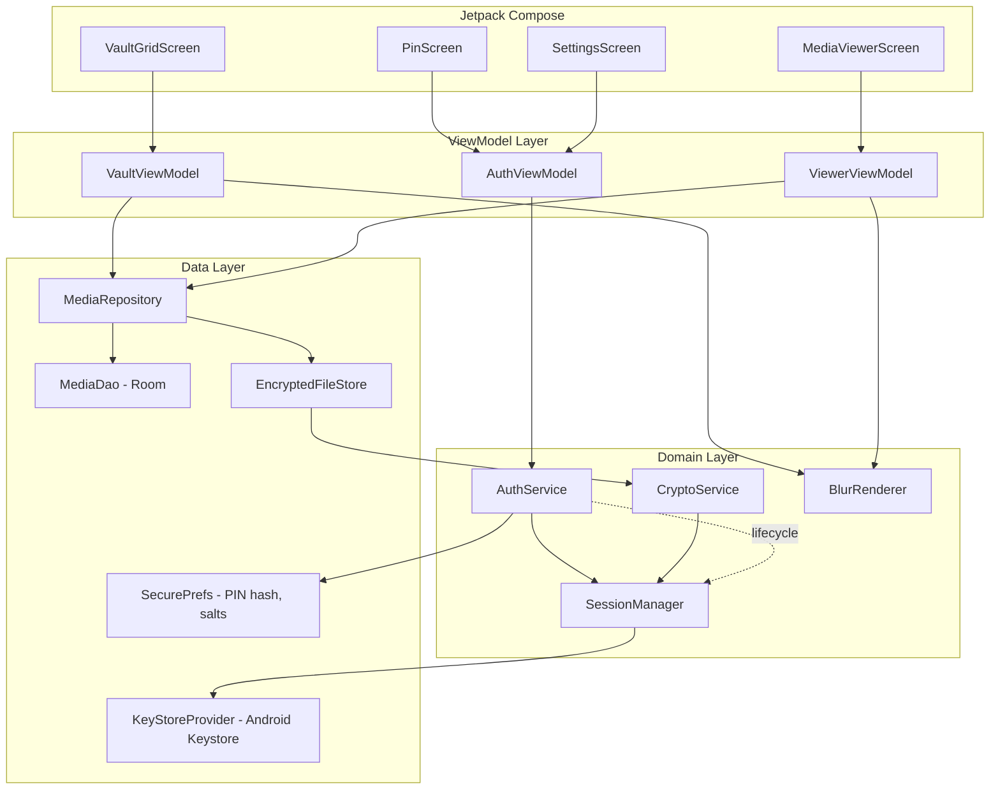
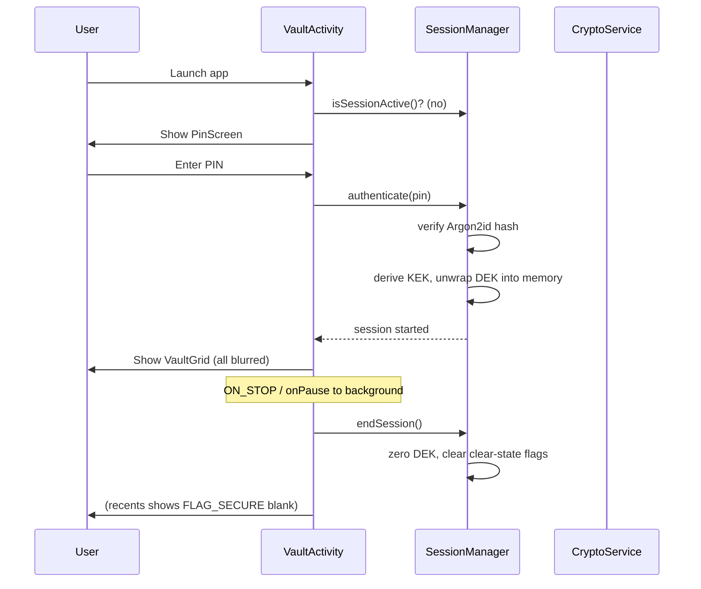
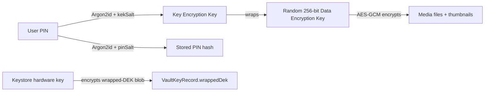

# Design Document: Private Media Vault

## Overview

Private Media Vault is a native Android application, distributed as an APK, that stores a user's sensitive images and videos in a PIN-protected, blurred-by-default, locally encrypted vault. The app is 100% offline: it has no network, cloud, or sync code paths and requests no internet permission.

The design centers on five concerns called out in the requirements:

1. **Encryption at rest** — Every media item is encrypted with AES-256-GCM. The file-encryption key (DEK) is wrapped by a key derived from the PIN and further protected by a hardware-backed key in the Android Keystore.
2. **PIN hashing and authentication** — The PIN is stored only as a one-way salted Argon2id hash. The same PIN, through a separate derivation, unlocks the DEK for the session.
3. **Blur rendering** — Items render blurred by default. Images blur via `RenderEffect`/Compose `Modifier.blur`; videos show a blurred extracted frame until cleared, then play via ExoPlayer.
4. **Session management** — Decryption keys live in memory only during an authenticated session. Backgrounding, explicit lock, and timeout zero the key and return everything to blurred. The recents/app-switcher snapshot is suppressed with `FLAG_SECURE`.
5. **Lifecycle operations** — Import, export, delete, and PIN change, each gated on an active session where required.

### Research Summary

- **AES-256-GCM** is the recommended authenticated cipher for local data at rest on Android; it provides confidentiality and integrity and avoids pattern leakage. ([Android data security guidance](https://developer.android.com/topic/security/data)) Content was rephrased for compliance with licensing restrictions.
- **Android Keystore** generates and stores key material in a way that makes extraction difficult, including hardware-backed storage on supported devices. ([Jetpack Security overview](https://android-developers.googleblog.com/2020/02/data-encryption-on-android-with-jetpack.html)) Content was rephrased for compliance with licensing restrictions.
- **Google Tink** provides a streaming AEAD primitive suited to large files (videos) so the whole file need not be held in memory; it builds on AES-256-GCM. The deprecated Jetpack Security `Crypto` library is avoided in favor of Keystore + Tink.
- **Blur rendering**: `RenderEffect.createBlurEffect` (API 31+) and Compose `Modifier.blur` blur drawn content directly; on older APIs a downscale-and-upscale bitmap technique is the fallback. ([RenderEffect reference](https://developer.android.com/reference/android/graphics/RenderEffect)) Content was rephrased for compliance with licensing restrictions.
- **App-switcher protection**: setting `WindowManager.LayoutParams.FLAG_SECURE` on the activity window causes the system to omit content from the recents thumbnail and block screenshots.

### Key Design Decisions

| Decision | Choice | Rationale |
|----------|--------|-----------|
| Cipher | AES-256-GCM (Tink streaming AEAD for files) | Authenticated, integrity-checked, standard on Android |
| PIN auth storage | Argon2id salted hash | One-way, memory-hard, satisfies Req 1.5 |
| Data key protection | DEK wrapped by PIN-derived KEK, then by Keystore key | Binds decryption to PIN knowledge AND device; PIN change re-wraps DEK without re-encrypting media |
| Blur (image) | `RenderEffect`/`Modifier.blur` at high radius, content never decrypted to clear surface until unblur | No persisted blurred copy needed; clear pixels only exist transiently in session |
| Blur (video) | Blurred poster frame by default; ExoPlayer playback only in clear state | Avoids decoding/playing sensitive video unless explicitly cleared |
| Session key lifetime | In-memory only; zeroed on background/lock/timeout | Satisfies Req 5.4 and Req 9 |
| UI | Jetpack Compose + MVVM + single-Activity | Modern, lifecycle-aware, recommended |

## Architecture

The app uses a single-Activity, MVVM architecture with a layered separation between UI, domain, and data. All cryptographic state is owned by a `SessionManager` that holds the decrypted DEK only while a session is active.



### Lifecycle and Session Flow



The `VaultActivity` observes the process lifecycle. `FLAG_SECURE` is set on the window at creation so the recents thumbnail never contains real content. On `ON_STOP` (moving to background), the activity calls `SessionManager.endSession()`, which zeroes the in-memory DEK and resets every item's render state to blurred.

### Offline Guarantee

The `AndroidManifest.xml` declares no `INTERNET` permission and no `ACCESS_NETWORK_STATE`. There are no HTTP clients, sync adapters, or analytics SDKs in the dependency set. This is enforced structurally (absence of capability) rather than at runtime, satisfying Requirement 3.

## Components and Interfaces

### SessionManager (domain)

Owns session state and the in-memory DEK. Single source of truth for "is a session active".

```kotlin
interface SessionManager {
    val sessionState: StateFlow<SessionState>   // Locked | Unlocked
    fun authenticate(pin: CharArray): AuthResult // Success | WrongPin | LockedOut(remainingSeconds)
    fun isUnlocked(): Boolean
    fun withDek(block: (SecretKey) -> Unit)       // throws if locked; never exposes DEK outside session
    fun endSession()                              // zeroes DEK, returns all items to blurred
}
```

### AuthService (domain)

Handles PIN creation, verification, lockout counting, and PIN change. Delegates key wrapping to `CryptoService`.

```kotlin
interface AuthService {
    fun isPinSet(): Boolean
    fun createPin(pin: CharArray, confirm: CharArray): CreateResult  // Mismatch | TooShort | Success
    fun verifyPin(pin: CharArray): VerifyResult                       // Correct | Incorrect | LockedOut(seconds)
    fun changePin(current: CharArray, newPin: CharArray, confirm: CharArray): ChangeResult
}
```

### CryptoService (domain)

Pure cryptographic operations. No Android UI dependencies; testable in isolation.

```kotlin
interface CryptoService {
    fun hashPin(pin: CharArray, salt: ByteArray): ByteArray          // Argon2id
    fun verifyPinHash(pin: CharArray, salt: ByteArray, hash: ByteArray): Boolean
    fun deriveKek(pin: CharArray, salt: ByteArray): SecretKey         // Argon2id -> 256-bit KEK
    fun wrapDek(dek: SecretKey, kek: SecretKey): ByteArray            // AES-256-GCM
    fun unwrapDek(wrapped: ByteArray, kek: SecretKey): SecretKey
    fun encryptStream(input: InputStream, output: OutputStream, dek: SecretKey, aad: ByteArray)
    fun decryptStream(input: InputStream, output: OutputStream, dek: SecretKey, aad: ByteArray)
}
```

### EncryptedFileStore (data)

Reads/writes encrypted media blobs in app-private storage (`context.filesDir/vault/`). Uses Tink streaming AEAD with the session DEK. Refuses to operate when the session is locked.

```kotlin
interface EncryptedFileStore {
    fun importFrom(uri: Uri, itemId: String): ImportOutcome   // copies + encrypts
    fun openDecrypted(itemId: String): InputStream             // requires unlocked session
    fun exportTo(itemId: String, destUri: Uri)                 // requires unlocked session
    fun delete(itemId: String): Boolean
}
```

### MediaRepository (data)

Coordinates the Room metadata database and the `EncryptedFileStore`, exposing the vault contents to view models.

```kotlin
interface MediaRepository {
    fun observeItems(): Flow<List<MediaItem>>
    suspend fun importItems(uris: List<Uri>, removeOriginals: Boolean): ImportReport
    suspend fun deleteItem(id: String): Boolean
    suspend fun exportItem(id: String, dest: Uri): ExportResult
    suspend fun decryptedThumbnail(id: String): Bitmap        // session-gated
}
```

### BlurRenderer (domain/UI)

Encapsulates the blur strategy so transport/storage and UI remain decoupled.

```kotlin
interface BlurRenderer {
    fun blurModifier(radius: Dp): Modifier                    // RenderEffect / Modifier.blur
    fun blurredPosterFrame(decrypted: Bitmap): Bitmap         // fallback path for API < 31
    fun isDiscernible(original: Bitmap, blurred: Bitmap): Boolean  // test/QA helper
}
```

### KeyStoreProvider (data)

Wraps Android Keystore. Generates/retrieves the hardware-backed key that encrypts the wrapped-DEK blob at rest.

```kotlin
interface KeyStoreProvider {
    fun getOrCreateMasterKey(): SecretKey      // AES-256-GCM, hardware-backed where available
    fun encryptBlob(plaintext: ByteArray): ByteArray
    fun decryptBlob(ciphertext: ByteArray): ByteArray
}
```

## Data Models

### MediaItem (Room entity — metadata only, no media bytes)

```kotlin
@Entity(tableName = "media_items")
data class MediaItem(
    @PrimaryKey val id: String,            // UUID
    val displayName: String,
    val mediaType: MediaType,              // IMAGE | VIDEO
    val encryptedFileName: String,         // file under filesDir/vault/
    val sizeBytes: Long,
    val durationMs: Long?,                 // videos only
    val importedAt: Long,                  // epoch millis
    val encryptedThumbName: String         // small encrypted thumbnail blob
)

enum class MediaType { IMAGE, VIDEO }
```

Render state (blurred vs clear) is **runtime UI state**, never persisted, so the default on every load is blurred (Req 6.1).

```kotlin
data class MediaRenderState(
    val itemId: String,
    val isClear: Boolean = false           // resets to false each session
)
```

### Vault Key Material (stored in SecurePrefs / files, never plaintext keys)

```kotlin
data class VaultKeyRecord(
    val pinSalt: ByteArray,        // salt for Argon2id auth hash
    val pinHash: ByteArray,        // Argon2id one-way hash (Req 1.5)
    val kekSalt: ByteArray,        // salt for Argon2id KEK derivation
    val wrappedDek: ByteArray,     // DEK encrypted by KEK (AES-256-GCM), then by Keystore key
    val argonParams: ArgonParams  // memory, iterations, parallelism
)
```

### Session State

```kotlin
sealed interface SessionState {
    data object Locked : SessionState
    data class Unlocked(val startedAt: Long) : SessionState
}

data class LockoutState(
    val consecutiveFailures: Int = 0,
    val lockoutUntil: Long? = null   // epoch millis; when set, entry rejected
)
```

### Operation Result Types

```kotlin
data class ImportReport(val succeeded: List<String>, val failed: List<FailedImport>)
data class FailedImport(val sourceName: String, val reason: String)

sealed interface AuthResult { 
    data object Success : AuthResult
    data object WrongPin : AuthResult
    data class LockedOut(val remainingSeconds: Int) : AuthResult 
}
```

### Key Hierarchy



On PIN change, only the KEK changes: the DEK is unwrapped with the old KEK and re-wrapped with the new KEK. Media files are never re-encrypted (Req 12.3).

## Correctness Properties

These universal properties are derived from the requirements and the cryptographic/session design above. Each is intended to be validated with a jqwik property-based test over generated inputs (random PINs, byte payloads, key material, item sets, and timing values). Each property cites the requirement clause(s) it protects.

- **Property 1 — PIN length validation is total.** For any candidate PIN string, `createPin` returns `TooShort` exactly when the numeric digit count is below 4, and never rejects a PIN of 4 or more digits for length reasons. _(Req 1.2)_

- **Property 2 — PIN creation requires matching confirmation.** For any pair `(pin, confirm)` of length-valid inputs, `createPin` returns `Success` if and only if `pin == confirm`; otherwise it returns `Mismatch` and no PIN record is written. _(Req 1.3, 1.4)_

- **Property 3 — PIN hashing is salted and one-way.** For any PIN and any two distinct salts, `hashPin` produces different hashes; the stored value never equals the plaintext PIN; and `verifyPinHash` returns true for the original PIN and false for every PIN that differs. _(Req 1.5)_

- **Property 4 — PIN verification is exact.** For any stored PIN, `verifyPin` returns `Correct` for an input equal to the stored PIN and `Incorrect` for any input that differs (when not locked out). _(Req 2.2, 2.3)_

- **Property 5 — Lockout triggers at the fifth consecutive failure.** For any sequence of attempts, a `LockedOut` state begins precisely when consecutive incorrect attempts reach 5, and a single correct attempt before that threshold resets the failure count. _(Req 2.4)_

- **Property 6 — Lockout countdown is bounded and monotonic.** For any active lockout observed at increasing timestamps, the reported remaining seconds is always within `[0, 30]` and never increases as time advances. _(Req 2.4, 2.5)_

- **Property 7 — Media encryption round-trips.** For any byte payload and any valid DEK and AAD, `decryptStream(encryptStream(payload)) == payload`. _(Req 5.2, 5.3)_

- **Property 8 — Encryption provides integrity.** For any encrypted payload, decryption fails (throws/returns error) when the ciphertext is tampered with, when a different DEK is used, or when the AAD differs from the one used at encryption. _(Req 5.2)_

- **Property 9 — DEK wrapping round-trips and is key-bound.** For any DEK and KEK, `unwrapDek(wrapDek(dek, kek), kek)` yields a key equal to `dek`, and unwrapping with any different KEK fails. _(Req 5.2, 12.3)_

- **Property 10 — Decryption is session-gated.** For any item, `openDecrypted`, `exportTo`, and `decryptedThumbnail` succeed only while the session is unlocked and refuse (throw/deny) whenever the session is locked. _(Req 5.3, 5.4, 7.2, 11.2)_

- **Property 11 — Import partitions inputs without loss.** For any list of source URIs where an arbitrary subset fails, the resulting `ImportReport.succeeded` and `failed` sets are disjoint and their union equals the input set; every successful item is present in vault contents. _(Req 4.1, 4.3)_

- **Property 12 — Items load blurred by default.** For any freshly loaded set of media items, every `MediaRenderState.isClear` is `false`. _(Req 6.1)_

- **Property 13 — Blurred rendering is not discernible.** For any source image, `isDiscernible(original, blurred)` is `false` for the produced blurred output. _(Req 6.2)_

- **Property 14 — Session end returns everything to blurred.** For any set of items with an arbitrary subset previously cleared, after `endSession()` every `MediaRenderState.isClear` is `false`. _(Req 6.3, 9.1, 9.2)_

- **Property 15 — PIN change re-wraps the DEK without re-encrypting media.** For any old/new PIN pair, after a successful `changePin`, the DEK unwrapped via the new KEK equals the original DEK, the encrypted media bytes are unchanged, the old PIN no longer verifies, and the new PIN verifies. _(Req 12.1, 12.2, 12.3)_
